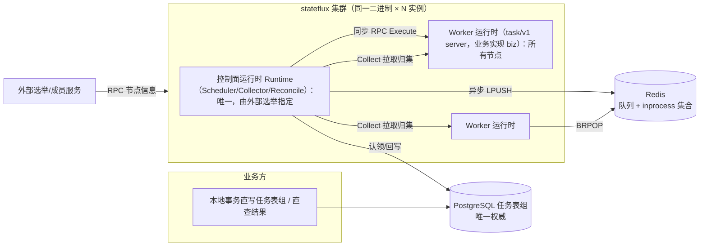

# stateflux 设计 · 准则与总体架构（§1–§2）

> v3.17（2026-09-11）。§ 编号全库沿用，文件映射见 [README](./README.md)。

## 1. 设计准则（硬约束）

1. 中间件只有 PG 与 Redis，均中心化部署；Go 实现。官方服务装配只有一个进程（`cmd/stateflux`，
   §1.2.8）。
2. 分布式选举逻辑外置：进程通过 RPC 获取当前集群节点信息（成员、角色、调度节点位置）。
3. 生命周期四阶段（阶段集合为逻辑抽象，下述表名为默认实现的命名，§3.1）：
   - **创建**：任务写入 PG `pending_tasks`（payload 同事务写入 `task_payloads`）；
   - **调度分发**：经约束晋升（pending → schedulable）后由 `schedulable_tasks` 认领完成，与创建解耦；调度节点全集群唯一；
   - **执行**：所有节点都可执行。同步方式 = 调度节点调用执行节点 RPC 并等结果；异步方式 = 调度节点投递 Redis queue（LIST），执行节点消费执行。同步/异步取决于结果是否需要及时回执；
   - **归集**：同步执行自带归集（RPC 响应即结果）；异步执行由执行节点提供用于结果归集的 RPC 接口。
4. 创建与结果归集都支持批处理。
5. Redis 维护一个 **inprocess 任务状态集合**，作为各节点的共识。
6. 四阶段分别可做分布式扩展，以提高框架吞吐量上限。

### 1.1 与旧文档的关系

| 议题 | 旧方案（v1/v2） | 本方案 |
| --- | --- | --- |
| PG 表模型 | pending/processing/history 三表搬移 | 四阶段分区表 pending/schedulable/processing/completed + payload 分离（§3.1）：恢复表搬移模型并升级——新增调度预处理层（约束晋升）、统一历史表（含 payload） |
| 异步投递 | 调度节点 gRPC 直推 Worker | 投递 Redis LIST 队列，执行节点 BRPOP 消费 |
| inprocess | 逐 key TTL | 单一集合，可校验归属的共识结构 |
| 异步结果 | Worker 主动 push | 执行节点提供 `Collect` RPC，调度侧拉取归集 |
| 调度节点 | 多调度节点 + 一致性哈希分片 | 调度节点唯一；分片作为阶段 2 的扩展开关 |
| prepared 候选层 | pending 与认领之间的逻辑队列 | 恢复为物化就绪层 `schedulable_tasks`：约束晋升产出，量级远小于 pending（§5.2） |

### 1.2 工程原则

1. **PG 是唯一权威**：任务「该做什么」只由任务表组决定；Redis 是可重建的实时视图，key 全部带 TTL。
2. **先认领、后调用**：任何外部调用（RPC/入队）前，任务必须已在 PG 中完成认领（进入 `processing_tasks`）。
3. **批量写 PG、窄通道通信**：PG 写全部批量化；跨节点通信面保持最小且可审计。
4. **执行节点不持有权威状态**：崩溃即丢失，由租约到期 + 对账接管重派。
5. **投递语义 at-least-once，业务幂等是安全前提**。
6. **集群信息只读不治**：stateflux 不实现选举，`ClusterView` 是唯一集群事实来源。
7. **调度侧集权、执行侧无状态**：任务的路由分发（选节点/选队列/优先级）、并发约束与业务约束
   全部留在调度侧（§5.2/§5.3）；执行侧不做任何调度决策，只消费任务、执行 handler、缓冲结果——
   本地结果 WAL 与容量上报是易失的派生数据而非权威状态（呼应第 4 条）。执行侧因此可随时增减、
   崩溃无损失，扩容就是加进程。
8. **服务优先（v3.9 修订，v3.10 以 internal/ 机制固化）**：本项目交付的是**独立部署的分布式任务
   调度服务**——单一官方二进制（`cmd/stateflux` 入口 + `internal/server` 编排装配）即产品本体；
   各运行时与角色包（biz/runtime（scheduler/collector/reconcile）/worker/factory/dispatch）是
   服务的引擎内部组件，置于 `internal/` 之下，「不作为三方库对外承诺 API、不支持嵌入业务进程」由
   Go internal 可见性规则**编译器强制**（§8；无顶层公开引擎包，内核并入 `internal/domain`，见 §8）。
   业务经本地事务直写任务表组跨进程接入（§5.1；业务接入 RPC 契约不做）；业务执行逻辑以
   `Handler` 形式在服务构建时注册（§7），task/v1 服务端业务由 `internal/biz` 承载（§8）。
9. **数据访问统一走 ent，观测统一走 OpenTelemetry**：任务表组的全部读写基于 ent
   （entgo.io/ent，Kratos 官方集成指南推荐的 ORM），schema 即代码；并发认领、批量挪行、
   `ON CONFLICT` 等关键 SQL 通过 ent 原生 SQL 下沉，不被 ORM 隐式重写（§3.1）。指标与链路追踪统一
   OpenTelemetry（§6.5），导出协议可替换。

## 2. 总体架构

### 2.1 进程与角色模型

- 集群里运行同一个二进制 `stateflux` 的 N 个实例，每个实例通过 `ClusterView`（外部选举服务的 RPC
  客户端）周期性获取节点信息：节点 ID/地址/角色/能力标签 + 当前调度节点 ID。
- 角色启用：**Worker 运行时（含 biz 业务实现）所有实例常驻**；**控制面运行时 Runtime
  （Scheduler/Collector/Reconciler）** 仅在外部选举指向本实例时运行，故障切换后新调度节点从 PG
  自然接管（认领与对账全部幂等，无需交接协议）。路由、并发与业务约束全部在 Scheduler 内（§1.2.7）；
  Worker 实例只执行，无差别可替换。
- 单机/开发模式：`cluster.static` 把全部角色赋给本进程，一个进程闭环。
- 角色分离部署（预留，§1.2.8）：`ClusterView`/角色开关支持把 Worker 角色单独成进程（专用执行
  节点）、其余角色由调度服务承担；`ClusterView` 对部署形态一视同仁。
