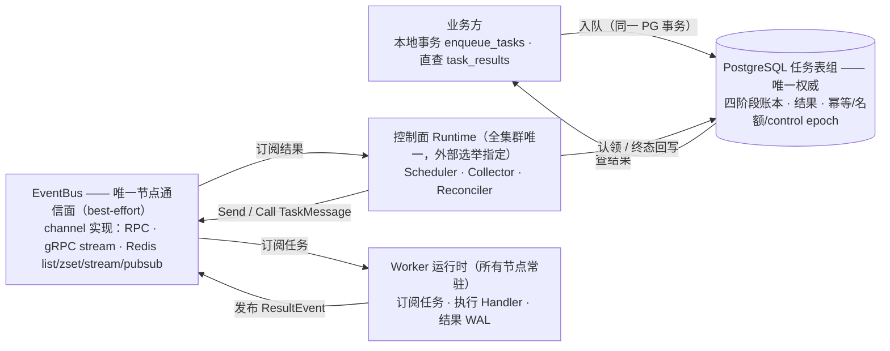

# stateflux 设计 · 准则与总体架构（§1–§2）

> v3.20（2026-09-12）。§ 编号全库沿用，文件映射见 [README](./README.md)。

## 1. 设计准则（硬约束）

1. 中间件只有 PG 与 Redis，均中心化部署；Go 实现。官方服务装配只有一个进程（`cmd/stateflux`，
   §1.2.8）。
2. 分布式选举逻辑外置：进程通过 RPC 获取当前集群节点信息（成员、角色、调度节点位置）。
3. 生命周期四阶段（阶段集合为逻辑抽象，下述表名为默认实现的命名，§3.1）：
   - **创建**：业务在本地事务中调用 PG `enqueue_tasks` 写入 `pending_tasks`、payload 与幂等身份记录；
   - **调度分发**：经约束晋升（pending → schedulable）后由 `schedulable_tasks` 认领完成，与创建解耦；调度节点全集群唯一；
   - **执行**：所有节点都可执行。调度器经 EventBus 发送任务：同步 RPC channel 立即返回结果；异步 channel 仅确认发送，执行节点稍后发布结果。创建方均通过结果查询获知状态；
   - **归集**：Collector 订阅 EventBus 的结果 topic；direct RPC 返回的结果也适配为同一 `ResultEvent`。所有路径共用终态事务。
4. 创建与结果归集都支持批处理。
5. Redis 与 RPC 都只是 `eventbus/channel` 的传输实现；任何通道均可丢消息、重复或在发送者未知的情况下实际送达。任务可靠性只由 PG 认领、终态与对账保证。
6. 四阶段分别可做分布式扩展，以提高框架吞吐量上限。

### 1.1 与旧文档的关系

| 议题 | 旧方案（v1/v2） | 本方案 |
| --- | --- | --- |
| PG 表模型 | pending/processing/history 三表搬移 | 四阶段分区表 pending/schedulable/processing/completed + payload 分离（§3.1）：恢复表搬移模型并升级——新增调度预处理层（约束晋升）、统一历史表（含 payload） |
| 节点通信 | 固定 RPC/Redis 通道 | `eventbus/channel` 抽象；RPC、gRPC stream、Redis list/zset/stream/pubsub 可替换 |
| Redis 定位 | 半持久队列 + 执行视图 | 不可靠传输实现；不以 AOF、PEL、ACK 或任何 Redis 状态作正确性前提 |
| 异步结果 | Worker 经独立通道直接 push | 统一 `ResultEvent` 经 EventBus 归集：同步 RPC 的响应适配为同一事件，Collector 订阅 result topic |
| 调度节点 | 多调度节点 + 一致性哈希分片 | 调度节点唯一；分片作为阶段 2 的扩展开关 |
| prepared 候选层 | pending 与认领之间的逻辑队列 | 恢复为物化就绪层 `schedulable_tasks`：约束晋升产出，量级远小于 pending（§5.2） |

### 1.2 工程原则

1. **PG 是唯一权威**：任务、幂等身份、并发预留与控制面 epoch 只由 PG 决定；EventBus 是无权威、可丢失的通信面。
2. **先认领、后调用**：任何外部调用（RPC/入队）前，任务必须已在 PG 中完成认领（进入 `processing_tasks`）。
3. **批量写 PG、窄通道通信**：PG 写全部批量化；跨节点通信面保持最小且可审计。
4. **执行节点不持有权威状态**：崩溃即丢失，由租约到期 + 对账接管重派。
5. **投递语义 at-least-once，业务幂等是安全前提**。
6. **选举外置但控制面必须自我 fencing**：`ClusterView` 决定谁有资格尝试运行控制面；PG `control_leases` 生成单调 epoch，并为晋升、认领、重置和终态控制操作附加 fence。外部选举短暂双主不能突破并发约束或让陈旧控制面继续写入。
7. **调度侧集权、执行侧无状态**：任务的路由分发（选节点/选 channel/优先级）、并发约束与业务约束
   全部留在调度侧（§5.2/§5.3）；执行侧不做任何调度决策，只订阅任务、执行 handler、发布结果——
   本地结果 WAL 与容量上报是易失的派生数据而非权威状态（呼应第 4 条）。执行侧因此可随时增减、
   崩溃无损失，扩容就是加进程。
8. **服务优先（v3.9 修订，v3.10 以 internal/ 机制固化）**：本项目交付的是**独立部署的分布式任务
   调度服务**——单一官方二进制（`cmd/stateflux` 入口 + `internal/server` 编排装配）即产品本体；
   各运行时与角色包（biz/runtime（scheduler/collector/reconcile）/worker/factory/dispatch）是
   服务的引擎内部组件，置于 `internal/` 之下，「不作为三方库对外承诺 API、不支持嵌入业务进程」由
   Go internal 可见性规则**编译器强制**（§8；无顶层公开引擎包，内核并入 `internal/domain`，见 §8）。
   业务经本地事务调用受限的 PG 写入函数跨进程接入（§5.1；业务接入 RPC 契约不做）；业务执行逻辑以
   `Handler` 形式在服务构建时注册（§1.2.8、§8 的 `internal/server` 装配与 Handler 注册点），
   task/v1 服务端业务由 `internal/biz` 承载（§8）。
9. **数据访问统一走 ent，观测统一走 OpenTelemetry**：任务表组的全部读写基于 ent
   （entgo.io/ent，Kratos 官方集成指南推荐的 ORM），schema 即代码；并发认领、批量挪行、
   `ON CONFLICT` 等关键 SQL 通过 ent 原生 SQL 下沉，不被 ORM 隐式重写（§3.1）。指标与链路追踪统一
   OpenTelemetry（§6.4），导出协议可替换。

## 2. 总体架构

读图要点：

- PG 是唯一权威，EventBus 整层可丢失/重复/长时间不可用：Send/Call 的返回不用于推断任务是否执行（§1.2.1、§5.3）。
- Worker 只发 ResultEvent、不写 PG，终态只在 Collector 的一次事务内发生（§5.5）。
- 换 channel 实现（RPC / gRPC stream / Redis）只改变延迟与成本，不改变任何流向（§11）。
- 「唯一节点通信面」指任务与结果通道：`ClusterView` 是外部选举/成员服务的 RPC 客户端，属显式例外，
  不由 EventBus 承载（§2.1、§8）。
- direct RPC（半双工 request/reply）的两端就是调用双方（Scheduler → Worker），中间没有 broker；
  图中 EB 表示 channel 抽象本身，不代表部署拓扑（§3.2、§5.3）。

### 2.1 进程与角色模型

- 集群里运行同一个二进制 `stateflux` 的 N 个实例，每个实例通过 `ClusterView`（外部选举服务的 RPC
  客户端）周期性获取节点信息：节点 ID/地址/角色/能力标签 + 当前调度节点 ID。
- 角色启用：**Worker 运行时（含 biz 业务实现）所有实例常驻**；**控制面运行时 Runtime
  （Scheduler/Collector/Reconciler）** 仅在外部选举指向本实例且已取得 PG 控制租约时运行；故障切换后
  新调度节点以新 epoch 从 PG 自然接管。路由、并发与业务约束全部在 Scheduler 内（§1.2.7）；
  Worker 实例只执行，无差别可替换。
- 单机/开发模式：`cluster.static` 把全部角色赋给本进程，一个进程闭环。
- 角色分离部署（预留，§1.2.8）：`ClusterView`/角色开关支持把 Worker 角色单独成进程（专用执行
  节点）、其余角色由调度服务承担；`ClusterView` 对部署形态一视同仁。
