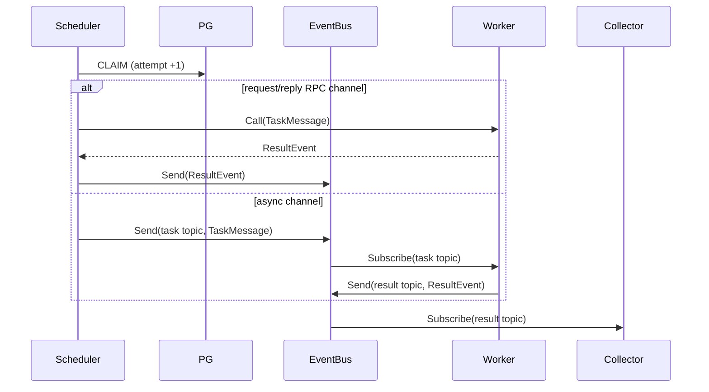

# stateflux 设计 · 四阶段流程（§5）

> v3.20（2026-09-12）。§ 编号全库沿用，文件映射见 [README](./README.md)。

## 5. 四阶段流程

### 5.1 创建

业务在状态变更的同一 PG 事务调用 `enqueue_tasks`。函数以全局唯一 `idempotency_key` 原子写
identity、payload 与 pending 并返回 task ID；重复请求在 dedupe 窗口内返回原 ID。NOTIFY 只能作
唤醒，tick 不可关闭。创建方对所有 channel 统一查询 `task_results`，不承诺创建 RPC 同步回执。

### 5.2 晋升与认领

Promoter 仅判断纯前置条件（含 `vpc`/`node`/`label`/`hash_bucket` 等调度目标节点属性，§3.1），批量
`pending → schedulable`。claim 事务按同一组约束筛选候选，迁移到 processing 并递增 attempts。
attempt 由 PG 裁决，不能由 channel 或 worker 本地状态裁决。

### 5.3 通过 EventBus 分发

Scheduler 按任务 `channel` 选择 `eventbus/channel` 实现、按 `vpc`/`node` 约束选择执行节点（§3.1，
路由决策全在调度侧），且只 claim 当前可立即发送的量：

同步 RPC channel 的 `Call` 等结果，异步 channel 的 `Send` 不等结果；二者差异仅是 channel 行为。任何
Send/Call 错误都不推断任务是否未执行：processing 留给 grace/R1 收敛。channel 可按能力选 RPC、gRPC
stream、Redis list/zset/stream/pubsub；Redis 提供的 ack 或持久化不可作为分支条件。

### 5.4 执行与结果发布

worker 订阅任务 topic，按 attempt 注册本地执行、运行 handler 并先写本地结果 WAL；随后向 result topic
发送 `ResultEvent`。WAL 重放会重复发布，允许。默认实现同时维护到调度节点的 gRPC 双向 result stream：
stream 断开时 worker 重连并重发未确认 WAL 条目。若改用 Redis result channel，语义仍是可丢失/可重复。

worker 不直接写 PG 终态，也不决定重试。可选的 Redis 容量提示视图（`internal/domain/cacheview`，§8）
仅用于调度提示和观测；其丢失不得改变 R1 结论。

### 5.5 订阅归集与重试

Collector 订阅 result topic，将 RPC 适配结果与异步 worker 结果汇入一个批处理器。每条结果通过一次
PG 事务：验证 attempt → processing 迁移 completed、payload 合并入
`task_results`、派生 callback、写墓碑。墓碑即 `task_results` 的 `task_id` 主键终态行：
重复 ResultEvent 因主键冲突被拒，不再产生副作用。

可重试失败只回 schedulable，**不增加 attempts**（v3.21 起 run_at 退役、无退避，重置后立即重新可认领）；下次 claim 才会生成新 fence。
如果 ResultEvent 永远没有抵达（包括 Redis 全丢），R1 在 `max(timeout, dispatch_grace) + skew` 后重置
processing，因此正确性不依赖 EventBus 可达。

### 5.6 工厂与回调

TaskFactory 和 callback 仍只创建一次性任务；Factory 仅在当选的调度节点运行，错过周期窗口
跳过。Factory 生成的任务在任务行记录 `batch_id`，`task_completeds` 按该列建索引供工厂孤儿判定使用。
OnSuccess/OnError 在终态事务内按 `parent:attempt:outcome` 幂等键派生，深度上限 8。
