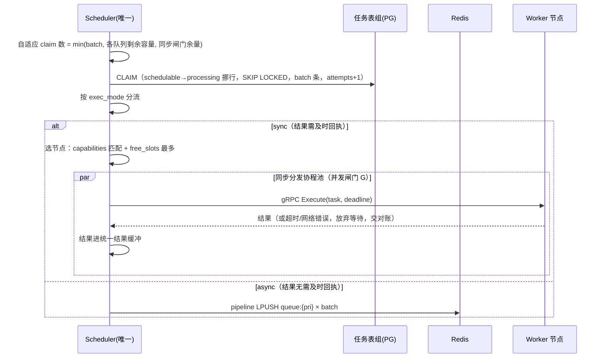
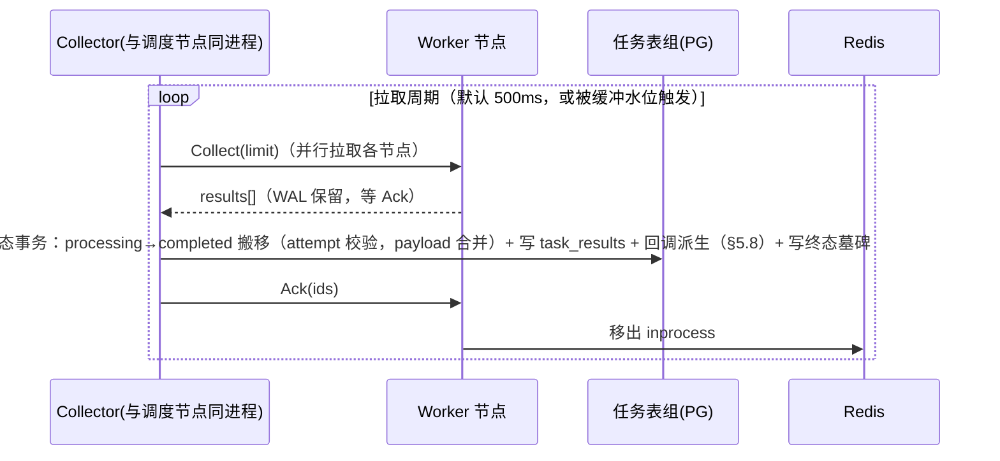

# stateflux 设计 · 四阶段流程（§5）

> v3.16（2026-09-10）。§ 编号全库沿用，文件映射见 [README](./README.md)。

## 5. 四阶段流程

### 5.1 创建（批处理）

**接入模式：业务直写任务表组（outbox 式）**。业务方在自身业务状态变更的**同一个本地事务**内
INSERT 任务行，天然消除「改业务状态 + 创建任务」的双写不一致——PG 是共享中间件，这是本架构的
天然优势。业务接入 RPC 契约不做（v3.16 收敛：原模式 B `CreateTasks` RPC 移除），不便直连 PG 的
业务方不在框架接入范围内。

幂等语义：`idempotency_key` 冲突时跳过插入、沿用已存在的 task_id（唯一性覆盖非终态三表，§3.1）。

- 创建只写 PG，不触碰 Redis——创建与调度彻底解耦，调度按自己的节奏扫表。
- 攒批：业务方显式批写；单事务行数设上限防长事务。
- 同步任务创建后，创建方直查 `task_results` 获取回执（§5.6）。
- **NOTIFY 实施约束**：必须使用专用连接（与 PgBouncer transaction mode 不兼容）；payload 留空
  （仅作唤醒信号，不承载事实）；不持久化，无监听者时通知即丢。定时 tick 兜底默认开启且**不可
  配置关闭**——NOTIFY 只能作低延迟优化，不能作正确性来源。

### 5.2 调度预处理（约束晋升：pending → schedulable）

调度节点内晋升器：扫描 `pending_tasks`（`run_at` 到期）→ 约束评估通过 → 批量挪入
`schedulable_tasks`。**可调度性在这里判定**，认领面只剩小而纯的就绪集。schedulable 是逻辑就绪集
抽象（§3.1）：调度器只依赖 `domain.TaskRepository` 的逻辑接口（晋升/认领），默认实现为 PG 表，替换实现不改变
本层语义：

- **内置约束**：per-type / per-key 全局并发上限——按 `processing_tasks` 在途计数判定；
- **业务约束钩子**：业务在构建时经 `domain` 注册 `Precondition`（返回任务类型 + 判定函数），晋升前由框架调用；
- 双触发沿用：定时 tick + NOTIFY/容量信号驱动；约束未通过的任务留在 pending，等待下轮评估，
  不占用认领扫描。

### 5.3 调度分发（唯一调度节点）

调度主循环 **双触发**：定时 tick（默认 100ms）兜底 + NOTIFY/容量信号驱动。

- **认领数自适应**：只认领当前消化得下的量；claimed-but-not-delivered 的任务滞留超过 grace 会被对账
  重置，因此不允许「认领后压在手里等」。
- **同步并发闸门**：协程池上限 + 单任务 deadline；超时后调度节点不断定执行结果，任务交对账裁决。
- **调度节点唯一**：由外部选举指定，故障切换无内部交接协议，唯一损失是切换期间的调度延迟。
- 优先级与公平：LPUSH/BRPOP 按 high→normal→low；同优先级内按 run_at FIFO。
- 异步投递消息体 = proto TaskMessage（内联完整任务，§3.3）；同步 Execute 请求复用同一信封。

### 5.4 执行（所有节点）

- **async 消费循环**：`BRPOP` 多队列（一条命令天然按优先级消费）→ 注册 inprocess（被拒绝则丢弃消息，
  说明是陈旧副本或他人持有）→ 执行 handler（ctx 带超时，执行中周期续租）→ 结果写入执行侧结果 WAL
  → 等归集 Ack 后移出 inprocess。消息为 proto TaskMessage 内联完整任务，消费零 PG 读（§3.3）。
- **sync 执行**：gRPC `Execute` → 同样的注册/续约逻辑 → 结果随 RPC 响应返回（调度侧归集，不经 WAL）。
- 执行节点周期上报 `free_slots`。
- **执行侧结果 WAL（异步结果存储）**：append-only 磁盘日志，handler 返回后先落 WAL 再视为完成；
  内存索引供 `Collect` 拉取；`Ack` 推进截断水位（按段复用/批量截断）；**重启重放**未 Ack 条目继续
  供拉，避免已执行任务重跑。WAL 仍是**非权威**派生状态（§1.2.7）：文件损坏/丢失 → 条目作废，由
  对账 R1 重跑兜底，不变式不变。**高水位反压**：WAL 积压超过阈值（默认 10k 条或 256MB）时暂停
  `BRPOP`，队列深度上升反馈调度侧缩 claim（§6.4）。

### 5.5 归集（批处理）

- **pull 模型**（准则第 4 条：执行节点提供归集 RPC）。WAL 在 Ack 前不截断、Collect 重入安全、
  PG 回写 attempt 幂等——三者共同保证结果至多落一次库、绝不丢。
- **终态事务**：processing → completed（outcome = succeeded/failed）搬移 + payload 从
  `task_payloads` 合并入 completed 行并删除分离行 + **task_results 一次性写入**（冲突即重复
  归集、跳过）+ **回调派生**（§5.8，注入源 = 本事务刚写入的 task_results 行）——全部同一事务。
- **重试路径**：可重试失败且未耗尽 attempts → 挪回 `schedulable_tasks`（attempt+1、
  `run_at = now + 退避`，约束已通过不重评）；耗尽 → completed{dead}。
- 同步任务的结果由调度节点直接进统一结果缓冲，与异步结果共用一条 flush 通道 → 全框架只有一条
  PG 终态写路径。
- 归集延迟预算：缓冲双阈值（200 条或 1s）+ 拉取周期 500ms ≈ 亚秒级；「及时回执」由同步模式承担。

### 5.6 同步任务的创建方回执

调度侧的「同步」指调度节点阻塞等执行结果；创建方回执走**直查**：查 `task_results`（终态即命中），
未命中查阶段表判断在途状态。长轮询 `GetResults` RPC 随业务接入契约一并移除（v3.16 收敛）；
推送型回执（Redis pub/sub 精准唤醒）保留为预留扩展，不属框架契约。

### 5.7 任务工厂（TaskFactory：周期/定时任务）

period/cron 是**任务的生成逻辑**，不引入新数据模型：TaskFactory 按 period 或 cron 计划周期性
生成一次性任务实例，走「创建 → 调度 → 执行 → 归集」既有全链路。语义采用 Vault 轮转器的
生产验证范式：

- `next = last_success + period` 现算（cron 模式为 `schedule.Next(now)`），**不持久化绝对时间点**，
  避免「存的时间点漂移」一类 bug 与补偿逻辑；
- **错过窗口即跳过、不补跑**：生成的是「周期性意图」而非积压债务，追跑会造成风暴且无收益；
  可选 window 字段约束允许的迟到上限；
- 重试超限的工厂条目冻结为**孤儿**并显式告警，停止自动生成、等待人工修复后重新注册——
  宁可冻结也不无限刷错误；
- 运行位置与调度节点同进程（单调度者原则：仅调度节点构建生成队列，与 Vault「仅 active 节点建
  轮转队列」同构）；故障切换后新调度节点从 PG 重建生成状态。

### 5.8 回调派生（借鉴 Machinery 的 callback 核心）

任务完成时可自动派生后续任务。语义借鉴 Machinery 的 callback 核心逻辑，且仅此而已——不引入
chain/group/chord 编排原语：

- 创建时任务可携带 **OnSuccess / OnError 回调规格**（回调任务类型 + payload 模板，存于任务行
  `callback` 字段；规格可嵌套以覆盖链式场景，设深度上限）；
- 触发时的参数注入照搬 Machinery 核心：**OnSuccess** 将父任务结果注入回调任务参数；
  **OnError** 将错误信息作为回调任务首参；
- **派生位置是本框架与 Machinery 的关键差异**：Machinery 由 worker 执行完直接 SendTask 派生；
  stateflux 改为在 **Collector 终态回写事务内派生**——回调任务创建与父任务终态回写在同一 PG
  事务，全框架仍只有一条终态写路径；回调任务幂等键 = `parent_task_id + attempt + outcome`，
  归集重拉导致的重复回写不会重复派生，执行节点也无需任务创建权限；
- 同步与异步任务统一获得该能力：二者结果都汇入同一条终态写路径（§5.5）。
