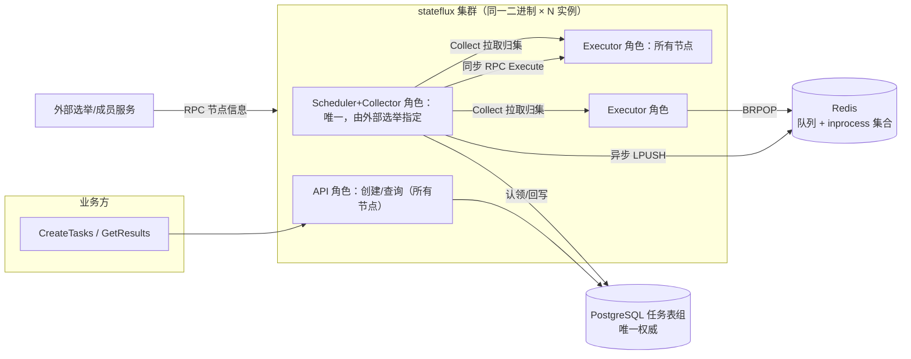
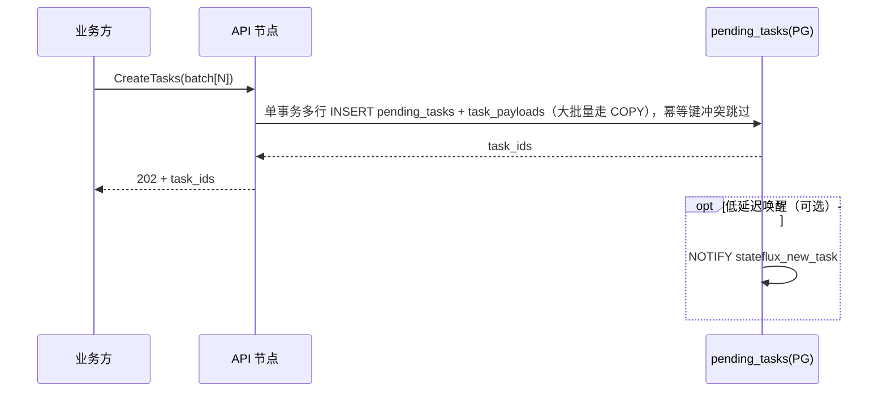
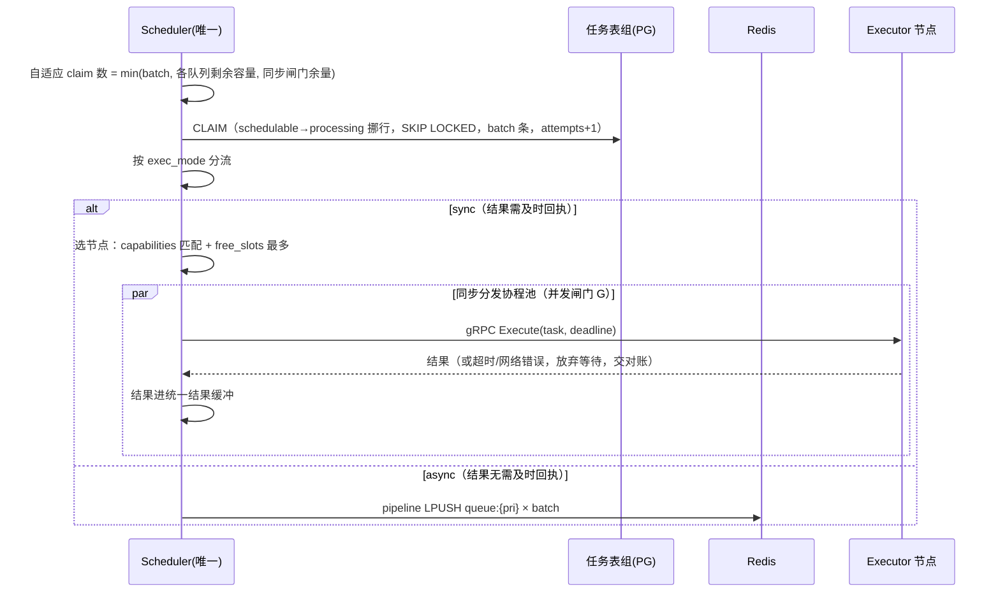
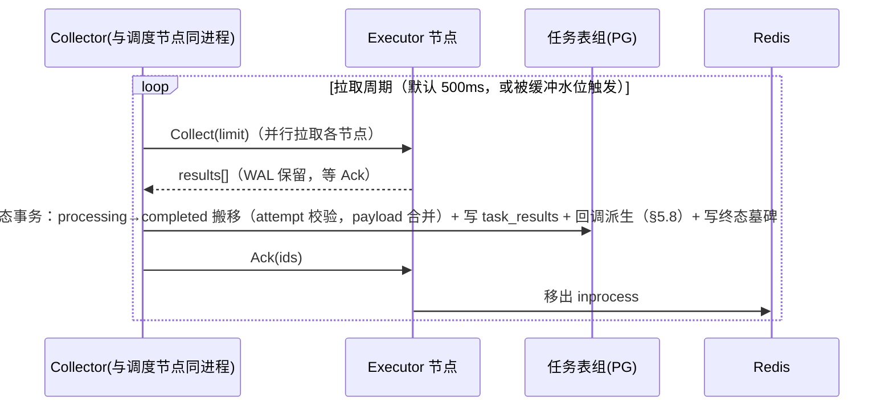

# stateflux 设计方案

> 版本：v3.8（2026-09-09）。新增**技术栈约定**：数据库操作统一走 ent（entgo.io/ent，Kratos 官方
> 集成指南推荐的 ORM，§3.1）、proto 契约统一 proto3（§3.3）、观测采用 OpenTelemetry 指标采集
> （§6.5）。v3.7 要点：**结果集设计**：`task_results` 独立结果表（终态事务一次性写入、不可变，
> 保留期与历史归档解耦）+ **执行侧异步结果 WAL**（append-only 磁盘日志、Ack 水位截断、重启重放、
> 高水位反压，§3.1/§5.4）。v3.6：阶段集合逻辑抽象、PG 分区表为默认实现（§3.1）。v3.5：调度侧
> 集权/执行侧无状态、框架优先（§1.2.7/8）。v3.4：调度预处理层（§5.2）。更早：Machinery callback
> （§5.8）、TaskMessage（§3.3）、创建双模式（§5.1）、TaskFactory（§5.7）、目录平铺 + sdk/（§8）。
> 实现级细节留待实施阶段。

## 1. 设计准则（硬约束）

1. 中间件只有 PG 与 Redis，均中心化部署；Go 实现。官方服务装配只有一个进程（`cmd/stateflux`，
   §1.2.8）。
2. 分布式选举逻辑外置：进程通过 RPC 获取当前集群节点信息（成员、角色、调度节点位置）。
3. 生命周期四阶段（阶段集合为逻辑抽象，下述表名为默认实现的命名，§3.1）：
   - **创建**：任务写入 PG `pending_tasks`（payload 同事务写入 `task_payloads`）；
   - **调度分发**：经约束晋升（pending → schedulable）后由 `schedulable_tasks` 认领完成，与创建解耦；调度节点全集群唯一；
   - **执行**：所有节点都可执行。同步方式 = 调度节点调用执行节点 RPC 并等结果；异步方式 = 调度节点投递 Redis queue（LIST），执行节点消费执行。同步/异步取决于结果是否需要及时回执；
   - **归集**：同步执行自带归集（RPC 响应即结果）；异步执行由执行节点提供用于结果归集的 RPC 接口。
4. 创建与结果归集都支持批处理。
5. Redis 维护一个 **inprocess 任务状态集合**，作为各节点的共识。
6. 四阶段分别可做分布式扩展，以提高框架吞吐量上限。

### 1.1 与旧文档的关系

| 议题 | 旧方案（v1/v2） | 本方案 |
| --- | --- | --- |
| PG 表模型 | pending/processing/history 三表搬移 | 四阶段分区表 pending/schedulable/processing/completed + payload 分离（§3.1）：恢复表搬移模型并升级——新增调度预处理层（约束晋升）、统一历史表（含 payload） |
| 异步投递 | 调度节点 gRPC 直推 Worker | 投递 Redis LIST 队列，执行节点 BRPOP 消费 |
| inprocess | 逐 key TTL | 单一集合，可校验归属的共识结构 |
| 异步结果 | Worker 主动 push | 执行节点提供 `Collect` RPC，调度侧拉取归集 |
| 调度节点 | 多调度节点 + 一致性哈希分片 | 调度节点唯一；分片作为阶段 2 的扩展开关 |
| prepared 候选层 | pending 与认领之间的逻辑队列 | 恢复为物化就绪层 `schedulable_tasks`：约束晋升产出，量级远小于 pending（§5.2） |

### 1.2 工程原则

1. **PG 是唯一权威**：任务「该做什么」只由任务表组决定；Redis 是可重建的实时视图，key 全部带 TTL。
2. **先认领、后调用**：任何外部调用（RPC/入队）前，任务必须已在 PG 中完成认领（进入 `processing_tasks`）。
3. **批量写 PG、窄通道通信**：PG 写全部批量化；跨节点通信面保持最小且可审计。
4. **执行节点不持有权威状态**：崩溃即丢失，由租约到期 + 对账接管重派。
5. **投递语义 at-least-once，业务幂等是安全前提**。
6. **集群信息只读不治**：stateflux 不实现选举，`ClusterView` 是唯一集群事实来源。
7. **调度侧集权、执行侧无状态**：任务的路由分发（选节点/选队列/优先级）、并发约束与业务约束
   全部留在调度侧（§5.2/§5.3）；执行侧不做任何调度决策，只消费任务、执行 handler、缓冲结果——
   本地结果 WAL 与容量上报是易失的派生数据而非权威状态（呼应第 4 条）。执行侧因此可随时增减、
   崩溃无损失，扩容就是加进程。
8. **框架优先，cmd/ 仅为服务装配**：本项目实现的是**任务调度框架**——各角色包
   （scheduler/executor/collector/factory/reconcile）是可独立装配的框架组件，业务方即可对接独立
   部署的 stateflux 服务，也可将框架（或其部分角色，如仅 executor）嵌入自身进程装配自己的服务
   （与 River/Asynq 的库形态一致）；`cmd/stateflux` 只是官方提供的全角色合一参考装配，不是框架
   本体。
9. **数据访问统一走 ent，观测统一走 OpenTelemetry**：任务表组的全部读写基于 ent
   （entgo.io/ent，Kratos 官方集成指南推荐的 ORM），schema 即代码；并发认领、批量挪行、
   `ON CONFLICT` 等关键 SQL 通过 ent 原生 SQL 下沉，不被 ORM 隐式重写（§3.1）。指标采集统一
   OpenTelemetry（§6.5），导出协议可替换。

## 2. 总体架构



### 2.1 进程与角色模型

- 集群里运行同一个二进制 `stateflux` 的 N 个实例，每个实例通过 `ClusterView`（外部选举服务的 RPC
  客户端）周期性获取节点信息：节点 ID/地址/角色/能力标签 + 当前调度节点 ID。
- 角色启用：**API 与 Executor 所有实例常驻**；**Scheduler + Collector + Reconciler** 仅在外部选举
  指向本实例时运行，故障切换后新调度节点从 PG 自然接管（认领与对账全部幂等，无需交接协议）。
  路由、并发与业务约束全部在 Scheduler 内（§1.2.7）；Executor 实例只执行，无差别可替换。
- 单机/开发模式：`cluster.static` 把全部角色赋给本进程，一个进程闭环。
- 嵌入形态（§1.2.8）：业务方亦可自行装配——例如把 executor 角色嵌入业务进程、其余角色由独立
  stateflux 服务承担；`ClusterView` 对两种形态一视同仁。

## 3. 数据模型

### 3.1 任务存储模型（逻辑阶段集合 + PG 默认实现）

生命周期四阶段首先是**逻辑抽象**：Pending / Schedulable / Processing / Completed 四个阶段集合，
由 `store` 包以统一接口暴露（创建入集、约束晋升、认领挪行、终态搬移、对账扫描）。**PG 四阶段
分区表 + payload 分离表是该接口的默认实现**，整体可替换（如退回单表 + 状态列）而不改变调度与
执行语义；下文沿用表名指代各逻辑阶段。默认实现中，生命周期阶段由**所在表**表达（`status` 列
取消），四张阶段表共享同一套核心字段：

`id`（雪花）、`type`、`priority`、`exec_mode`（sync/async）、`run_at`（最早可调度时间，承载
延迟/重试退避）、`timeout_ms`、`max_attempts`/`attempts`、`owner_node`、`error`（终态错误
摘要，完整结果在 `task_results`）、`idempotency_key`（业务幂等键）、`batch_id`（批量创建归组）、
`callback`（jsonb，OnSuccess/OnError 回调规格，§5.8）、`parent_task_id`（回调派生溯源）、时间戳。

| 表 | 语义 | 要点 |
| --- | --- | --- |
| `task_payloads` | payload 分离表：`task_id` + `payload`（jsonb） | 阶段表查询面不背 payload；终态搬移时合并入 completed 后删除 |
| `pending_tasks` | 已创建，等待调度预处理 | 约束晋升的扫描对象（§5.2） |
| `schedulable_tasks` | 就绪可调度（逻辑就绪集），量级显著小于 pending | 调度认领的扫描对象；可调度性由并发约束与业务约束在晋升时判定 |
| `processing_tasks` | 已调度（在队列/inprocess/分发协程中） | 认领与**重试逻辑**所在；已入本表的任务不可取消 |
| `completed_tasks` | 统一历史表，`outcome ∈ {succeeded, failed, dead}` | 内联 payload（便于排查），**不内联 result**（完整结果在 `task_results`，行内仅留 error 摘要）；按 `created_at` 分区 + detach 归档 |
| `task_results` | 结果集：`task_id` 主键 + `outcome`/`attempt`/`result`（jsonb）/`error`/`completed_at` | 终态事务内**一次性写入、不可变**；业务结果的保留期与 completed 归档策略**解耦**（独立 TTL/分区）；大 result 同 payload 规则（>64KB 走对象存储引用） |

- **每任务全生命周期约 5 次批量行操作**：INSERT pending → 约束晋升挪 schedulable → 认领挪
  processing（attempts+1）→ 终态事务双行（completed 行含 payload 合并 + task_results 行）。
  行操作全部批量化，换取热表小、扫描快、历史天然分离（§9.2、§10）。
- 认领 = `schedulable_tasks` → `processing_tasks` 的单条 `UPDATE ... WHERE id IN (SELECT ...
  FOR UPDATE SKIP LOCKED)` 挪行，查询与迁移原子完成，天然防重复认领；终态搬移**attempt 匹配
  才生效**，重复搬移无副作用（幂等）。
- 超过 `max_attempts` 记 `dead`（outcome），进 completed_tasks 便于排查。
- 索引：pending 晋升扫描 `(priority DESC, run_at)`；schedulable 认领部分索引；processing 对账
  `(updated_at)`；completed 查询 `(type, created_at)`。
- 幂等键唯一性需覆盖非终态三表（实施阶段给出方案：创建时查重 + 各表局部唯一索引）。
- `task_results` 与终态搬移同事务写入（INSERT ... ON CONFLICT DO NOTHING，冲突即重复归集、
  跳过），写入后不可变；`GetResults` 先查本表，未命中再查阶段表判断在途状态（§5.6）。
- 大 payload（>64KB）不入库，业务方写对象存储后传引用。
- **实现载体 = ent**：六张表以 ent schema（entgo.io/ent）定义为代码，迁移由代码生成；认领挪行、
  终态事务、`ON CONFLICT DO NOTHING` 等并发关键路径以 ent 原生 SQL 下沉（Modify/raw），不依赖
  ORM 生成的隐式语句；常规读写走 ent 生成的类型安全 API。模式 A（业务直写）不受影响——业务方
  仍可用任意客户端直写任务表组，ent schema 只约束框架侧实现。

### 3.2 Redis 结构

| key | 结构 | 用途 |
| --- | --- | --- |
| `stateflux:queue:{pri}` | LIST | 异步就绪队列，默认按 high/normal/low 三级拆分；消息体 = proto TaskMessage（内联完整任务，§3.3） |
| `stateflux:inprocess` | ZSET | 共识集合：member=task_id，score=租约到期时间 |
| `stateflux:inprocess:detail` | HASH | member → {node_id, attempt, started_at}，归属校验与观测 |
| `stateflux:done:{task_id}` | STRING | 终态墓碑，TTL 自动回收 |
| `stateflux:node:{node_id}` | HASH | 执行节点容量上报（free_slots），供选节点与观测 |

**inprocess 集合的共识语义**（正确性核心）：

- 成员定义：**已被认领、但尚未在 PG 落终态的任务**（执行中 + 执行完但结果未归集）。
- 集合操作全部原子且带归属校验：注册时检查墓碑与已有成员（重复投递/陈旧副本被拒绝），续约与移除
  要求 node_id + attempt 匹配——僵尸节点无法覆盖新尝试的记录。
- Redis 全量丢失可由对账从 PG 重建；重建后正在执行的任务可能被重复派发，由 at-least-once + 业务幂等收敛。

### 3.3 消息载体（proto TaskMessage）

跨节点传输的任务载体由 protobuf 统一定义（`proto/dispatch.proto`，**proto3 语法**），字段借鉴
Machinery 的 `Signature`（UUID/Name/ETA/Priority/Headers）并适配本框架；内部（dispatch）与外部
（cluster）契约统一 proto3，可选字段（如 `trace_headers`）用 `optional` 显式表达存在性：

| 字段 | 说明 |
| --- | --- |
| `task_id` | 雪花 ID，与 PG 行对应 |
| `attempt` | fencing token，执行侧注册与回写校验的依据 |
| `type` / `payload` | 任务类型与载荷 |
| `priority` / `timeout_ms` / `deadline` | 执行控制 |
| `trace_headers` | 链路追踪传播（Machinery Headers 同款用途） |

- **内联完整任务**：任务创建后 payload 不可变，消息内联安全；大 payload（>64KB）本就走对象存储
  引用。执行侧 BRPOP 后零 PG 读，Redis 消息是「可执行的认领凭证」，PG 仍是状态与 payload 的
  唯一权威。
- **sync/async 统一载体**：异步队列 LPUSH 与同步 `Execute` RPC 请求共用同一信封，减少重复定义、
  便于统一注入 trace 与 attempt 语义。

## 4. 状态机与投递语义

```
pending_tasks ──约束晋升(§5.2)──▶ schedulable_tasks ──认领(CLAIM, attempts+1)──▶ processing_tasks
                                      ▲      │  终态搬移(§5.5, attempt 校验)   │        │
                                      │      └─重试/R1重置(attempt+1, 退避)──┘        ├─▶ completed_tasks{succeeded / failed}
                                      │                                              └─attempts 耗尽─▶ completed_tasks{dead}
```

- 投递语义 **at-least-once**：BRPOP 后注册前宕机、Redis 丢数据重建、终态搬移前执行节点宕机等窗口
  都会导致重复执行，业务 handler 必须按 `idempotency_key`（或 task_id + attempt）幂等。
- `processing_tasks` 中的任务表示「已认领」；任务此刻在队列里、inprocess 里、或同步分发协程中，
  精确位置以 Redis 为准。
- 取消边界：仅 `pending_tasks` / `schedulable_tasks` 中的任务可取消（v2 提供），已入
  `processing_tasks` 不可取消。

## 5. 四阶段流程

### 5.1 创建（批处理）

**双接入模式**：

- **模式 A（首选）：业务直写任务表组（outbox 式）**。业务方在自身业务状态变更的**同一个本地
  事务**内 INSERT 任务行，天然消除「改业务状态 + 创建任务」的双写不一致——PG 是共享中间件，
  这是本架构的天然优势。适用于业务库与任务表组同实例或可直连 PG 的场景。
- **模式 B：`CreateTasks` RPC**。留给不便直连 PG 的业务方；此时「业务状态变更 + 任务创建」的
  双写由业务方自行收敛（建议业务侧同样走本地 outbox 后再调用）。

两模式幂等语义一致：`idempotency_key` 冲突时跳过插入、返回已存在的 task_id。

RPC 路径时序：



- 创建只写 PG，不触碰 Redis——创建与调度彻底解耦，调度按自己的节奏扫表。
- 攒批：客户端显式批 + API 侧微批（可关）；单事务行数设上限防长事务。
- 同步任务创建后，创建方通过长轮询等回执（§5.6）。
- **NOTIFY 实施约束**：必须使用专用连接（与 PgBouncer transaction mode 不兼容）；payload 留空
  （仅作唤醒信号，不承载事实）；不持久化，无监听者时通知即丢。定时 tick 兜底默认开启且**不可
  配置关闭**——NOTIFY 只能作低延迟优化，不能作正确性来源。

### 5.2 调度预处理（约束晋升：pending → schedulable）

调度节点内晋升器：扫描 `pending_tasks`（`run_at` 到期）→ 约束评估通过 → 批量挪入
`schedulable_tasks`。**可调度性在这里判定**，认领面只剩小而纯的就绪集。schedulable 是逻辑就绪集
抽象（§3.1）：调度器只依赖 `store` 的逻辑接口（晋升/认领），默认实现为 PG 表，替换实现不改变
本层语义：

- **内置约束**：per-type / per-key 全局并发上限——按 `processing_tasks` 在途计数判定；
- **业务约束钩子**：业务通过 sdk 注册 `Precondition`（返回任务类型 + 判定函数），晋升前由框架调用；
- 双触发沿用：定时 tick + NOTIFY/容量信号驱动；约束未通过的任务留在 pending，等待下轮评估，
  不占用认领扫描。

### 5.3 调度分发（唯一调度节点）

调度主循环 **双触发**：定时 tick（默认 100ms）兜底 + NOTIFY/容量信号驱动。



- **认领数自适应**：只认领当前消化得下的量；claimed-but-not-delivered 的任务滞留超过 grace 会被对账
  重置，因此不允许「认领后压在手里等」。
- **同步并发闸门**：协程池上限 + 单任务 deadline；超时后调度节点不断定执行结果，任务交对账裁决。
- **调度节点唯一**：由外部选举指定，故障切换无内部交接协议，唯一损失是切换期间的调度延迟。
- 优先级与公平：LPUSH/BRPOP 按 high→normal→low；同优先级内按 run_at FIFO。
- 异步投递消息体 = proto TaskMessage（内联完整任务，§3.3）；同步 Execute 请求复用同一信封。

### 5.4 执行（所有节点）

- **async 消费循环**：`BRPOP` 多队列（一条命令天然按优先级消费）→ 注册 inprocess（被拒绝则丢弃消息，
  说明是陈旧副本或他人持有）→ 执行 handler（ctx 带超时，执行中周期续租）→ 结果写入执行侧结果 WAL
  → 等归集 Ack 后移出 inprocess。消息为 proto TaskMessage 内联完整任务，消费零 PG 读（§3.3）。
- **sync 执行**：gRPC `Execute` → 同样的注册/续约逻辑 → 结果随 RPC 响应返回（调度侧归集，不经 WAL）。
- 执行节点周期上报 `free_slots`。
- **执行侧结果 WAL（异步结果存储）**：append-only 磁盘日志，handler 返回后先落 WAL 再视为完成；
  内存索引供 `Collect` 拉取；`Ack` 推进截断水位（按段复用/批量截断）；**重启重放**未 Ack 条目继续
  供拉，避免已执行任务重跑。WAL 仍是**非权威**派生状态（§1.2.7）：文件损坏/丢失 → 条目作废，由
  对账 R1 重跑兜底，不变式不变。**高水位反压**：WAL 积压超过阈值（默认 10k 条或 256MB）时暂停
  `BRPOP`，队列深度上升反馈调度侧缩 claim（§6.4）。

### 5.5 归集（批处理）



- **pull 模型**（准则第 4 条：执行节点提供归集 RPC）。WAL 在 Ack 前不截断、Collect 重入安全、
  PG 回写 attempt 幂等——三者共同保证结果至多落一次库、绝不丢。
- **终态事务**：processing → completed（outcome = succeeded/failed）搬移 + payload 从
  `task_payloads` 合并入 completed 行并删除分离行 + **task_results 一次性写入**（冲突即重复
  归集、跳过）+ **回调派生**（§5.8，注入源 = 本事务刚写入的 task_results 行）——全部同一事务。
- **重试路径**：可重试失败且未耗尽 attempts → 挪回 `schedulable_tasks`（attempt+1、
  `run_at = now + 退避`，约束已通过不重评）；耗尽 → completed{dead}。
- 同步任务的结果由调度节点直接进统一结果缓冲，与异步结果共用一条 flush 通道 → 全框架只有一条
  PG 终态写路径。
- 归集延迟预算：缓冲双阈值（200 条或 1s）+ 拉取周期 500ms ≈ 亚秒级；「及时回执」由同步模式承担。

### 5.6 同步任务的创建方回执

调度侧的「同步」指调度节点阻塞等执行结果；创建方拿回执默认走**长轮询** `GetResults(task_ids, wait)`：
先查 `task_results`（终态即命中返回），未命中查阶段表判断在途状态后继续等待，归集 flush 后命中
即返回；可选扩展：Redis pub/sub 精准唤醒。

### 5.7 任务工厂（TaskFactory：周期/定时任务）

period/cron 是**任务的生成逻辑**，不引入新数据模型：TaskFactory 按 period 或 cron 计划周期性
生成一次性任务实例，走「创建 → 调度 → 执行 → 归集」既有全链路。语义采用 Vault 轮转器的
生产验证范式：

- `next = last_success + period` 现算（cron 模式为 `schedule.Next(now)`），**不持久化绝对时间点**，
  避免「存的时间点漂移」一类 bug 与补偿逻辑；
- **错过窗口即跳过、不补跑**：生成的是「周期性意图」而非积压债务，追跑会造成风暴且无收益；
  可选 window 字段约束允许的迟到上限；
- 重试超限的工厂条目冻结为**孤儿**并显式告警，停止自动生成、等待人工修复后重新注册——
  宁可冻结也不无限刷错误；
- 运行位置与调度节点同进程（单调度者原则：仅调度节点构建生成队列，与 Vault「仅 active 节点建
  轮转队列」同构）；故障切换后新调度节点从 PG 重建生成状态。

### 5.8 回调派生（借鉴 Machinery 的 callback 核心）

任务完成时可自动派生后续任务。语义借鉴 Machinery 的 callback 核心逻辑，且仅此而已——不引入
chain/group/chord 编排原语：

- 创建时任务可携带 **OnSuccess / OnError 回调规格**（回调任务类型 + payload 模板，存于任务行
  `callback` 字段；规格可嵌套以覆盖链式场景，设深度上限）；
- 触发时的参数注入照搬 Machinery 核心：**OnSuccess** 将父任务结果注入回调任务参数；
  **OnError** 将错误信息作为回调任务首参；
- **派生位置是本框架与 Machinery 的关键差异**：Machinery 由 worker 执行完直接 SendTask 派生；
  stateflux 改为在 **Collector 终态回写事务内派生**——回调任务创建与父任务终态回写在同一 PG
  事务，全框架仍只有一条终态写路径；回调任务幂等键 = `parent_task_id + attempt + outcome`，
  归集重拉导致的重复回写不会重复派生，执行节点也无需任务创建权限；
- 同步与异步任务统一获得该能力：二者结果都汇入同一条终态写路径（§5.5）。

## 6. 关键机制

### 6.1 故障恢复矩阵

| 故障 | 后果 | 收敛机制 |
| --- | --- | --- |
| 调度节点宕机 | 调度暂停；已认领未投递的任务滞留 processing | 外部选举切换；对账重置滞留任务 |
| 执行节点宕机（执行中） | 租约到期不再续 | 对账重置 → 重新认领重跑 |
| 执行节点宕机（结果未归集） | WAL 已落盘，任务滞留 processing | 重启重放 WAL 继续供拉；WAL 损坏则 R1 重跑兜底（幂等收敛） |
| Collect Ack 丢失 | WAL 保留，条目仍占 inprocess | 重拉 → PG 幂等回写 → 重新 Ack |
| 陈旧队列副本（重试后旧消息残留） | 两个执行节点先后消费同一任务 | 注册被拒（成员已存在/墓碑命中）→ 无害丢弃 |
| Redis 全量丢失 | 队列与 inprocess 清空 | 对账从 PG 重建：processing 全部按 R1 重置 |
| PG 单点 | 全框架不可用 | 中心化部署 + 云 HA / Patroni，超出框架范围 |

### 6.2 陈旧副本与墓碑

重试会重新入队，旧副本可能仍躺在队列里。两道防线：注册时的 attempt 校验（同一 attempt 成员已存在
→ 拒绝）；终态墓碑（任务已落终态后旧副本才被消费 → 拒绝）。墓碑 TTL ≥ grace（默认 90s），自动
回收。TTL 必须覆盖 grace 而非仅覆盖对账周期：若旧副本在「墓碑已过期、且新尝试已终态移出
inprocess」之后才被消费，两道防线均失效，旧 attempt 将重复执行——结果会被 attempt 校验挡住不落库，
但副作用已发生；TTL 取 ≥ grace 是廉价保险。

### 6.3 对账规则（运行于调度节点，周期 30s）

以 PG 为准绳、inprocess 为实时视图，双向核对：

- **R1 重置**：`processing_tasks` 中 `updated_at` 超过 grace（默认 90s），且不在 inprocess 或
  租约已过期 → 挪回 `schedulable_tasks`（attempt+1，`run_at = now + 退避`；约束已通过，不重评）。
  退避实现为 **capped exponential backoff + full jitter**（AWS 模式；默认初值 500ms、上限 1000s，
  参照 client-go workqueue）——无 jitter 的重试会在故障恢复后形成同步重试风暴，正好打在刚恢复的
  调度节点上；
- **R2 幽灵清理**：inprocess 中存在但 PG 已终态/不存在的条目 → 强制移除；
- **R3 死信**：重置时 `attempts >= max_attempts` → 直接挪入 `completed_tasks{dead}`；
- **R4 重建**：Redis 丢失后，扫全部 `processing_tasks` 按 R1 重置并重建集合结构。

### 6.4 反压

- 调度侧：claim 数由下游容量（队列深度、闸门余量）实时决定，从源头不超发；
- 执行侧：BRPOP 自节奏消费，处理不过来时消息滞留队列，深度反馈给调度侧缩 claim；
- 创建侧：不设反压，PG 吸收。

### 6.5 观测：OpenTelemetry 指标采集

- **单一采集标准**：全框架指标统一走 OpenTelemetry（`go.opentelemetry.io/otel/metrics`）。
  `config/` 装配全局 MeterProvider（周期性 Reader + OTLP Exporter，默认 60s 推送，endpoint/协议
  可配），各角色包只依赖注入的 Meter，不感知导出协议；指标与链路追踪共用同一 OTel SDK 与
  Resource（service.name、node_id、版本/环境标签），TaskMessage 的 `trace_headers`（§3.3）承载
  W3C 传播头。
- **采集点位收敛在既有写路径**：晋升、认领、终态事务、对账扫描、注册拒绝、WAL 水位等指标在
  store/queue/角色包的既定操作内埋点，不引入独立采集组件；gRPC 侧用统一 interceptor（unary/
  stream）产出 rpc qps/错误率/延迟。
- **最小指标集**（§12 压测调优的观测对象）：

| 指标 | OTel 类型 | 标签 | 归属 / 含义 |
| --- | --- | --- | --- |
| `stateflux.queue.depth` | ObservableGauge | priority | 调度：各就绪队列深度（LLEN）|
| `stateflux.inprocess.size` | ObservableGauge | — | 调度/对账：共识集合大小（ZCARD）|
| `stateflux.claim.to_deliver_latency` | Histogram | — | 调度：claim→投递延迟 |
| `stateflux.collect.latency` | Histogram | — | Collector：结果完成→终态落库（归集延迟）|
| `stateflux.reconcile.resets` | Counter | reason | 对账：R1 重置次数（核心健康信号）|
| `stateflux.inprocess.rejects` | Counter | kind（tombstone/attempt）| queue：注册拒绝数（§6.2 双防线命中）|
| `stateflux.tasks.terminal` | Counter | outcome | Collector：终态计数（succeeded/failed/dead）|
| `stateflux.wal.backlog` | ObservableGauge | — | Executor：WAL 未 Ack 条数/字节数（两个实例，反压水位）|
| `stateflux.executor.free_slots` | ObservableGauge | node_id | Executor：容量上报 |
| `stateflux.handler.duration` | Histogram | type | Executor：handler 耗时 |

- **标签纪律**：只允许低基数标签（priority、type 白名单、node_id、outcome、reason）；task_id/
  业务 key 禁止入标签，超限枚举折叠为 `other`，防标签基数爆炸。

## 7. RPC 契约

- **内部 gRPC（调度角色 ↔ 执行角色）**：`Execute`（同步任务，带 deadline）与 `Collect`（结果归集，
  pull + Ack）。
- **消息载体**：`dispatch.proto` 定义统一 `TaskMessage` 信封（§3.3），异步队列消息与 `Execute`
  请求共用。
- **外部契约（外部选举/成员系统实现，stateflux 只消费）**：`GetClusterInfo` 返回节点列表
  （ID/地址/角色/能力标签）与当前调度节点 ID。
- 业务接入点：业务方实现 `Handler`（返回任务类型 + 执行函数）并注册，框架负责生命周期与超时注入；
  关键接口的 Go 定义与 proto 细节在实施阶段给出。

## 8. 模块划分

```
stateflux/
├── cmd/stateflux/   # 官方服务装配（参考实现）：全角色合一的单进程入口；框架本体在下列包中
├── proto/           # 契约（proto3）：dispatch.proto（内部）+ cluster.proto（外部选举）
├── sdk/             # 业务方唯一依赖面：Task/TaskResult/状态机/Handler 接口
├── api/             # 阶段1 创建/查询/长轮询
├── scheduler/       # 阶段2 调度：约束晋升预处理/自适应认领/同步分发池/异步投递/选节点
├── executor/        # 阶段3 执行引擎：消费循环/租约/结果 WAL/gRPC server（无状态，仅执行）
├── collector/       # 阶段4 结果归集：Collect 拉取 → 终态搬移(含 payload 合并)/回调派生 → Ack
├── factory/         # TaskFactory 周期任务生成（仅调度节点运行）
├── reconcile/       # R1~R4 对账
├── store/           # 权威存储抽象：阶段集合逻辑接口；默认实现 = ent + PG 四阶段分区表 + payload 分离
├── queue/           # Redis 视图：就绪队列/inprocess 集合/墓碑/节点容量
├── cluster/         # ClusterView 外部接口 + RPC 客户端 + static 单机实现
└── config/          # 配置与观测注入：OTel MeterProvider/OTLP Exporter、观测钩子
```

依赖方向：`cmd → 角色包（api/scheduler/executor/collector/factory/reconcile）→ store/queue → sdk`。
顶层自上而下即架构分层：契约（proto/sdk）→ 四阶段角色 → 状态层（store/queue）→ 集群视图与装配
（cluster/cmd）。不设 `internal/` 编译期隔离，以 `sdk/` 显式命名公共契约面：**业务方只依赖 `sdk`**
（含 `Handler` 接口），其余包为引擎内部、约定不对外引用。各角色包是可独立装配的框架组件
（§1.2.8）：`cmd/stateflux` 只是官方全角色装配，业务方可嵌入部分角色（如仅 executor）自行组服务。

## 9. 关键设计决策

1. **认领将查询与迁移合并为单条 SQL**：schedulable→processing 挪行原子完成，消除「查完未认领
   就宕机」的重复分发窗口，重试天然幂等。
2. **每任务全生命周期约 4 次批量行操作**：创建/晋升/认领/终态搬移全部批量化；不落 running 行，
   执行位置由 Redis 承载。行操作次数换来小热表、快扫描与历史天然分离；PG 写吞吐推演见 §10。
3. **inprocess 是带归属校验的共识集合**：成员语义 = 已认领未终态，覆盖归集尾部窗口，使对账判定
   无模糊区间。
4. **陈旧队列副本由 attempt 校验 + 终态墓碑双防线拦截**：弥补 LIST 无 ack 机制的可靠性缺口。
5. **同步任务必须配并发闸门**：协程池上限 + deadline，超时交对账收敛，绝不无限阻塞调度节点。
6. **归集采用 pull + Ack 两段式**：WAL 保留、重拉安全、回写幂等，三者保证结果至多落一次库、绝不丢。
7. **自适应认领即反压**：不需要独立候选队列层，claim 数由下游容量实时决定。
8. **集群信息只读不治**：选举外置，认领与对账的幂等性就是调度节点故障切换的「交接协议」。
9. **周期任务以 TaskFactory 生成一次性实例承载**：不引入新数据模型；next 现算、错过即跳过、
   超限冻结孤儿，语义与 Vault 轮转器同构（§5.7）。
10. **创建侧双模式接入**：业务直写任务表组（outbox 式）消除双写不一致，`CreateTasks` RPC 服务
    于不便直连 PG 的业务方；两模式幂等语义一致（§5.1）。
11. **消息载体 protobuf 内联完整任务**：TaskMessage 统一信封（借鉴 Machinery Signature），payload
    不可变使内联安全，执行侧零 PG 读；PG 仍是状态与 payload 的唯一权威（§3.3）。
12. **回调在归集回写事务内派生**：对 Machinery「worker 执行完直接派生」的架构适配——保持单写
    路径、幂等键去重，执行节点无需任务创建权限，同步/异步统一获得回调能力（§5.8）。
13. **四阶段分区表 + payload 分离（默认实现）**：生命周期由阶段集合表达，可调度性在晋升时判定
    （schedulable 量级远小于 pending）；payload 分离降低查询面，completed 统一收历史并内联 payload
    便于排查；代价是每任务 ~5 次行操作，以批量写消化（§3.1、§5.2）。阶段集合是 `store` 暴露的
    **逻辑抽象**——PG 分区表仅为默认实现，吞吐不达标或运维需要时可整体替换，调度与执行语义不变。
14. **结果独立成集，终态事务一次性写入**：`task_results` 不可变、主键幂等，业务结果的保留期与
    completed 归档解耦；completed 不内联 result，避免双倍存储与两套保留期同步问题（§3.1、§5.5）。
15. **执行侧异步结果以 WAL 承载**：落盘先行 + Ack 水位截断 + 重启重放 + 高水位反压——防 Collector
    停摆时缓冲无限增长，把「崩溃丢失 → 必重跑」收窄为「WAL 损坏才重跑」；WAL 仍是非权威派生状态
    （§1.2.7、§5.4）。
16. **数据访问走 ent、观测走 OpenTelemetry**：ent schema 即代码，关键并发 SQL 以原生 SQL 下沉
    （§3.1）；指标统一 OTel，埋点收敛在既有写路径，OTLP 导出可替换（§6.5）。

## 10. 默认参数与容量模型

| 参数 | 默认值 | 说明 |
| --- | --- | --- |
| claim batch | 500 | 每 tick 认领上限，按队列容量自适应收缩 |
| 调度 tick | 100ms | 定时兜底 |
| 晋升 tick | 200ms | pending 约束评估 → schedulable |
| 同步分发池 | 512 goroutine | 超出排队等待 |
| 租约 lease / 续约 | 30s / 10s | score=到期时间 |
| 归集 flush | 200 条或 1s | 双阈值 |
| 结果 WAL 上限 | 10k 条或 256MB | 执行侧高水位，超过暂停 BRPOP |
| Collect 周期 | 500ms | 并行拉取各节点 |
| 对账周期 / grace | 30s / 90s | 滞留判定线 |
| 墓碑 TTL | 90s（≥ grace） | 覆盖旧副本消费窗口（§6.2） |
| 重试退避 | 500ms → 1000s | capped exponential + full jitter |
| 队列容量上限 | 10k/队列 | 反压阈值 |

单调度节点吞吐推演：claim 500 × 10 tick/s ≈ **5000 任务/s 的分发上限**；每任务 Redis 约 5~6 次 OPS，
中心 Redis 轻松承载 10 万+ OPS；PG 每任务 ~5 次行操作（创建/晋升/认领/终态事务双行，含 payload 合并）
且全部批量化——PG 写吞吐约束较单表模型翻倍，参考 Hatchet/River 的批量写经验仍可行，压测验证是
必经环节。各阶段吞吐上限排序：**调度节点 ≈ PG 写（权重上升）< Redis < 执行池**，扩展优先级与此一致。

## 11. 四阶段的分布式扩展路径

| 阶段 | 纵向优化（先做） | 横向扩展（后做） |
| --- | --- | --- |
| 1 创建 | 批量 COPY、单事务行数调优 | API 无状态多实例；completed_tasks 按 created_at 分区 + detach 归档 |
| 2 调度 | 调大 claim/晋升 batch 与 tick 频率；NOTIFY 驱动代替纯轮询 | **调度分片**：按 hash(type) 拆 N 个调度分片，每分片唯一调度者（外部选举给出 shard→node 映射，或一致性哈希方案作为开关）；sync 分发池独立扩容 |
| 3 执行 | 每节点并发槽调优 | 执行节点线性加机器；队列按 type 拆分避免单 LIST 热点；capabilities 路由异构任务 |
| 4 归集 | flush 批量加大、COPY+JOIN 合并写 | Collector 随调度分片一起横向；结果大 payload 走对象存储引用 |

## 12. 实施顺序

1. sdk 类型 + proto 契约（proto3，含 TaskMessage 统一信封与回调规格）+ config（含 OTel
   MeterProvider/OTLP Exporter 装配）；
2. store：先定义阶段集合逻辑接口（创建入集/晋升/认领挪行/终态搬移/结果写入/对账扫描），再以默认
   实现落地——ent schema 定义六张表（task_payloads + task_results + 四阶段表）+ ent 迁移 + 各
   操作 SQL（关键并发路径原生下沉；并发认领单测：只允许一个成功；僵尸节点用例：attempt 过期后
   写终态必须被拒）；
3. queue：inprocess 集合 Lua（注册/续约/移除，含墓碑与归属校验）+ 就绪队列；
4. executor：Handler 注册表 + 消费循环 + 结果 WAL（落盘/重放/水位反压）+ gRPC server；
5. scheduler：单调度节点闭环（约束晋升 → 自适应认领 → sync 分发池 / async LPUSH）+ 统一结果缓冲；
6. collector：Collect 拉取 → 终态事务（processing→completed 搬移，payload 合并 + task_results
   写入 + 回调派生，同一事务；单测：重复归集不重复写结果、不重复派生）→ 墓碑 → Ack（僵尸节点
   归集上报必须被拒）；
7. reconcile：R1~R4（退避 full jitter）+ 进程全灭重启的收敛验证；
8. cluster.static 单机闭环 → 接入外部 ClusterView，验证调度节点故障切换；
9. 死信运维面：dead 查询 + redrive 接口（人工修复后重跑，不自动重放）；
10. OTel 观测埋点（§6.5 指标清单）+ 压测调优（batch/tick/lease/grace 参数扫描；监控 PG
    autovacuum 与阶段表膨胀，fillfactor/HOT update 预留调优）。最小指标集见 §6.5：队列深度、
    inprocess 大小、claim→投递延迟、归集延迟、R1 重置次数（核心健康信号）、墓碑/attempt 拒绝数；
11. 按需启用扩展开关：调度分片、队列按 type 拆分、completed_tasks 分区归档。

## 13. 边界（不做的事）

- 不承诺 exactly-once：at-least-once 交付，业务 handler 必须幂等；
- 不强制杀死执行到一半的任务，只做超时 ctx 与优雅退出；
- 不实现业务执行器、选举服务与成员协议（均为外部/业务侧接入点）；
- PG 与 Redis 的 HA 属于部署域，不在框架范围内；
- 不承诺跨队列/跨分片全局有序，只在同队列内按优先级 + run_at FIFO；
- 不实现 chain/group/chord 编排原语：回调仅提供 OnSuccess/OnError 派生语义（§5.8），可嵌套规格
  覆盖链式场景，任务组聚合不属于框架范围；
- 取消（cancel）能力本期不做，v2 优先补齐；v2 取消仅覆盖 pending/schedulable 中的任务，已入
  processing 不可取消（见 §14 已确认决策）。

## 14. 已确认决策与遗留项（2026-09 评审）

### 已确认

1. **同步任务的创建方回执**：长轮询保底，Redis pub/sub 精准唤醒作为可选项实现；
2. **inprocess 成员语义**：维持「已认领未终态」（含结果未归集），避免归集尾部窗口的对账模糊区间；
3. **attempts 计数时机**：认领时 +1；「对账重置消耗一次重试预算」写入业务方文档，不为精确计数
   增加每任务 PG 写；
4. **取消能力**：本期不做，v2 优先补齐——同类框架（Asynq/Temporal/Celery 等）均将 cancel 视为
   必备能力；
5. **队列粒度**：默认按 priority 三级，出现类型级热点后再按 type 拆分（扩展开关原则）；
6. **任务表组四阶段分区模型**：pending/schedulable/processing/completed + payload 分离 + 统一
   历史表（2026-09 评审）；重试/对账重置回 schedulable（约束不重评）；v2 取消仅覆盖
   pending/schedulable，已入 processing 不可取消；
7. **结果集与执行侧 WAL**：task_results 独立表（终态事务一次性写入、不可变，completed 不内联
   result）；执行侧异步结果以磁盘 WAL 承载（Ack 水位截断、重启重放、高水位反压，仍非权威状态）
   （2026-09 评审）。
8. **技术栈约定**（2026-09-09 评审）：数据库操作统一走 ent（entgo.io/ent，Kratos 官方集成指南
   推荐的 ORM；schema 即代码，关键并发 SQL 原生下沉，§3.1）；proto 契约统一 proto3（§3.3）；
   观测统一 OpenTelemetry 指标采集（§6.5）。

### 遗留（v2 候选）

- **Redis Streams（`XAUTOCLAIM`）作为异步链路备选开关**：原生覆盖「BRPOP 后崩溃」窗口，把重复
  执行窗口从 grace(90s) 缩到 claim 超时；v1 维持 LIST + 对账；
- **执行中取消**：cancel 表 + 黑名单 + version 传播（v1 旧方案的完整设计）；
- 跨队列/跨分片全局有序（§13 边界，长期不做）。
